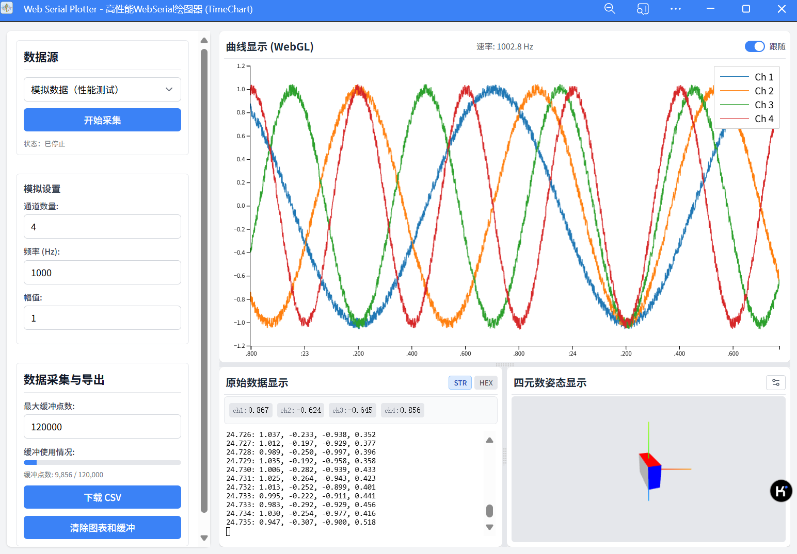

# 📊 Web Serial Plotter - 高性能网页串口绘图器

  
  

这是一个基于 **Web Serial API** 的高性能网页串口数据绘图和可视化工具，旨在提供一个**无需安装、跨平台**的串口数据监控解决方案。它利用 **Web Worker** 处理数据以保持主线程流畅，使用 **TimeChart** 库进行高效的 WebGL 加速绘图，并集成了 **Three.js** 实现四元数姿态的 3D 可视化，以及 **xterm.js** 来显示原始数据流。

**➡️ [点此在线体验 (GitHub Pages)](https://captainkaz.github.io/web-serial-plotter/)**

*(请注意：在线演示可能无法直接连接您的本地串口设备，这通常是浏览器安全策略的要求，但在本地运行或通过 HTTPS 部署时功能完整。)*

## ✨ 功能特点

* 🔌 **Web Serial 连接:** 通过浏览器直接连接和读取串口设备数据。
* 🧪 **模拟数据源:** 内置模拟数据生成器，方便无设备时进行功能测试和性能演示。
* 🧩 **多种解析协议:**
    * 支持多种内置串口数据解析协议（默认逗号/空格分隔、JustFloat、FireWater）。
    * 支持用户**自定义 JavaScript 解析函数**，提供最大的灵活性。
* 📈 **高性能实时绘图:**
    * 使用 [TimeChart](https://github.com/huww98/TimeChart) 库进行 WebGL 加速的多通道数据曲线绘制。
    * 交互式图表：支持缩放（鼠标滚轮）、平移（鼠标拖拽）。
    * 自动跟随最新数据或手动浏览历史数据（可切换）。
    * 图表通道数可根据接收到的数据动态增加。
* 🔢 **数据显示:**
    * 实时显示最新解析出的各通道数值。
    * 使用 [xterm.js](https://xtermjs.org/) 终端模拟器显示原始串口数据流，支持文本(STR)和十六进制(HEX)两种格式切换。
* **四元数 3D 可视化:**
    * 使用 [Three.js](https://threejs.org/) 实时展示基于四元数数据的 3D 物体姿态。
    * 需要用户从可用数据通道中选择代表 W, X, Y, Z 的四个通道。
* 💾 **数据缓冲与导出:**
    * 可配置数据点的内存缓冲大小。
    * 实时显示缓冲区使用百分比、已缓冲点数和预计剩余/总缓冲时间。
    * 可以将缓冲区内的数据点（时间戳和数值）导出为 CSV 文件。
* 🚀 **性能优化:**
    * 使用 Web Worker 进行数据处理和解析，避免阻塞浏览器主线程，确保 UI 流畅。
    * 优化数据批处理和 UI 更新逻辑。
* 📱 **现代化 Web 技术:**
    * 采用 ES Modules 进行模块化开发。
    * 支持 PWA (Progressive Web App)，可添加到主屏幕并具有一定的离线缓存能力 (通过 Service Worker)。
    * 使用 [Split.js](https://split.js.org/) 实现可拖拽调整大小的界面布局。
    * 使用 [Lucide Icons](https://lucide.dev/) 提供清晰的图标。

## 🚀 性能亮点 (Performance Highlight)

**我们致力于保持 Web Serial Plotter 的高性能特性。** Web Worker 的使用、WebGL 加速的 TimeChart 以及优化的数据处理流程都是为了确保应用的流畅运行，即使在处理高频数据时也是如此。

> **📊 基准参考:** 在我们的测试中（硬件：**NVIDIA RTX 3050, AMD Ryzen 7 6800HS**），使用模拟数据源以 **1000Hz** 频率处理 **40 个通道** 时，应用能够稳定、流畅地以 **~60 FPS** 运行。

我们欢迎任何能够进一步提升性能的贡献。

## 📸 截图 (Screenshots)

## 🛠️ 技术栈

* **核心 API:** Web Serial API, Web Workers API
* **绘图:** [TimeChart](https://github.com/huww98/TimeChart) (WebGL-based)
* **3D 可视化:** [Three.js](https://threejs.org/)
* **终端显示:** [xterm.js](https://xtermjs.org/)
* **布局:** [Split.js](https://split.js.org/), CSS (可能包含 Tailwind CSS 类)
* **图标:** [Lucide Icons](https://lucide.dev/)
* **数据处理/交互:** D3.js (部分库, 通过 CDN), Vanilla JavaScript (ES Modules)
* **PWA:** Service Worker, Manifest

## 🔧 如何使用

1.  **在线体验:**
    * 直接访问: **[https://captainkaz.github.io/web-serial-plotter/](https://captainkaz.github.io/web-serial-plotter/)**

2.  **本地运行 (完整功能):**
    * **环境要求:**
        * 需要支持 **Web Serial API** 的现代浏览器（例如：最新版本的 Google Chrome, Microsoft Edge）。
        * Web Serial API 通常需要**安全的上下文** (`https://`) 或在 `localhost` 上运行。
    * **步骤:**
        * 克隆或下载本仓库代码。
        * 使用一个简单的本地 Web 服务器 在项目根目录启动服务 (例如: `npx http-server .`)。
        * 通过浏览器访问 `http://localhost:PORT` (PORT 通常是 8080)。
        * > **⚠️ 重要提示:** 直接通过 `file://` 协议打开本地 `index.html` 文件 **无法** 使用 Web Serial API 功能。

3.  **操作流程:**
    * **选择数据源:** 在左侧控制面板的“数据源”下拉菜单中选择 "WebSerial"（或 "模拟数据" 进行测试）。
    * **(WebSerial) 配置参数:**
        * 根据您的设备设置正确的波特率、数据位、停止位、校验位和流控制。
        * 选择合适的“解析协议”。如果选择“自定义”，请在文本框中输入 JavaScript 解析函数代码，然后点击“更新解析器”按钮将代码发送到 Worker。
    * **(WebSerial) 连接设备:**
        * 点击“连接串口”按钮。
        * 浏览器会弹出设备选择窗口，选择您要连接的串口设备并点击“连接”。
    * **开始采集:** 点击“开始采集”按钮。应用将开始接收（或生成）数据并显示。
    * **查看姿态 (可选):** 如果数据包含四元数，点击“四元数姿态显示”模块右上角的设置图标，选择对应的 W, X, Y, Z 通道并点击“确认选择”。
    * **交互:**
        * 在曲线图区域，使用鼠标滚轮缩放时间轴，使用Shift+鼠标滚轮缩放数据轴，按住鼠标左键拖拽平移。双击图表可快速启用“跟随”模式并打开数据轴自动范围。
        * 切换“跟随”复选框来控制图表是否自动滚动到最新数据。
        * 在原始数据显示区域，点击 "STR" 或 "HEX" 按钮切换显示格式。
        * 拖动模块之间的分隔条调整布局大小。
    * **停止采集:** 点击“结束采集”按钮。
    * **数据导出/清除:**
        * 点击“下载 CSV”将当前缓冲区内的数据保存为 CSV 文件。
        * 点击“清除图表和缓冲”按钮会清空所有图表、缓冲区和统计数据。

## 📑 界面说明

* **控制面板 (左侧):**
    * **数据源:** 选择数据来源 (WebSerial/模拟)，控制开始/停止采集，显示连接状态。
    * **模拟设置:** (仅在数据源为模拟时可见) 配置模拟数据的通道数、频率和幅值。
    * **WebSerial 设置:** (仅在数据源为 WebSerial 时可见) 连接/断开串口，配置串口参数（波特率等），选择或自定义数据解析逻辑。
    * **数据采集与导出:** 设置缓冲区大小，查看缓冲区使用情况，提供下载 CSV 和清除数据的功能。
* **显示区域 (右侧，可调整布局):**
    * **曲线显示 (WebGL):** 使用 TimeChart 实时绘制数据曲线，可交互操作。
    * **原始数据显示:** 上方显示最新解析出的数值，下方使用 xterm.js 终端显示带时间戳的原始数据流 (STR/HEX)。
    * **四元数姿态显示:** 使用 Three.js 显示 3D 模型姿态，需要先配置通道。

## 📜 解析器说明

数据解析在 Web Worker 中进行，以避免阻塞主线程。

* **内置协议:**
    * **默认:** 解析以换行符 (`\n` 或 `\r\n`) 结束，由逗号或空格分隔的数值行。
    * **JustFloat:** 解析 `N` 个 4 字节小端浮点数后跟特定帧尾 `[0x00, 0x00, 0x80, 0x7f]` 的二进制帧。
    * **FireWater:** 解析形如 `<任意前缀>:<数值1>,<数值2>,...,<数值N>\n` 的文本行。
* **自定义解析器函数 (当协议选择 "自定义" 时):**
    * 您需要提供一个 JavaScript 函数体。该函数接收一个 `Uint8Array` 类型的参数 `uint8ArrayData`，代表从串口接收到的原始字节数据块。
    * 函数必须返回一个对象，格式为：`{ values: number[] | null, frameByteLength: number }`。
        * `values`: 解析成功时，包含一帧数据的数值数组 `number[]`；如果传入的 `uint8ArrayData` 中没有找到一个完整的帧，则返回 `null`。
        * `frameByteLength`: 如果解析成功 (`values` 非 `null`)，表示这一帧数据在输入的 `uint8ArrayData` 中消耗了多少字节；如果解析未成功 (`values` 为 `null`)，则应返回 `0`。
    * Worker 会持续调用此函数，直到输入的 `uint8ArrayData` 被完全消耗或函数返回 `frameByteLength: 0`。

## 🤝 贡献 (Contributing)

欢迎各种形式的贡献！如果您想参与改进 Web Serial Plotter，请直接提pr，如果有愿望单，也可以直接提issue。

## 📄 许可证 (License)

本项目采用 MIT 许可证。