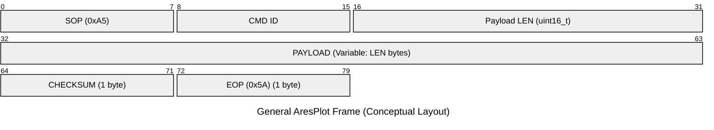
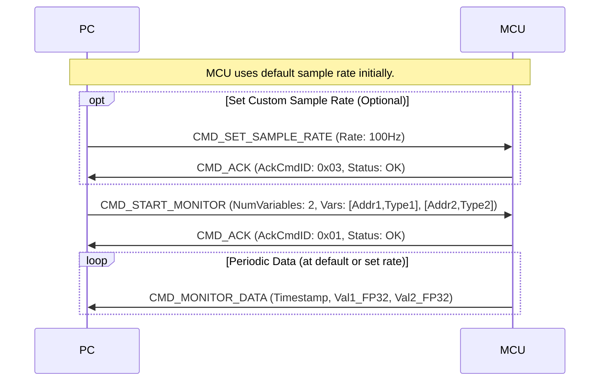
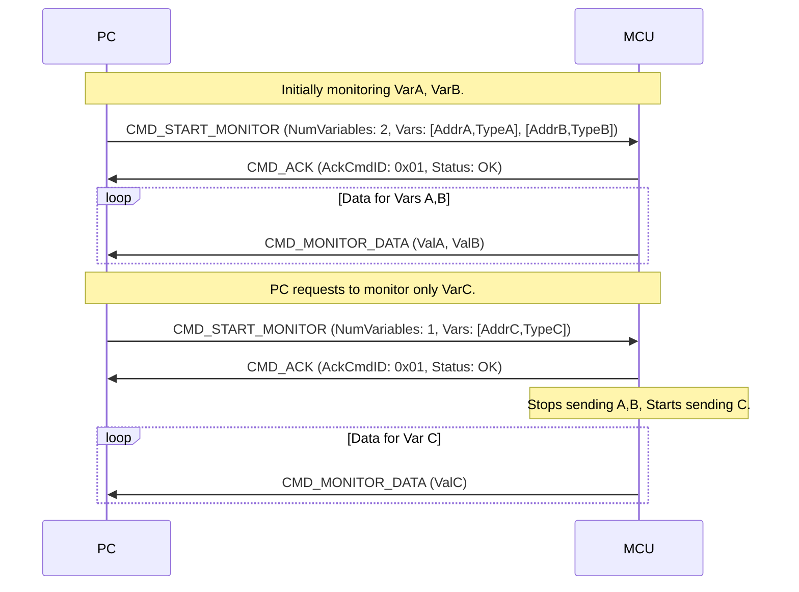
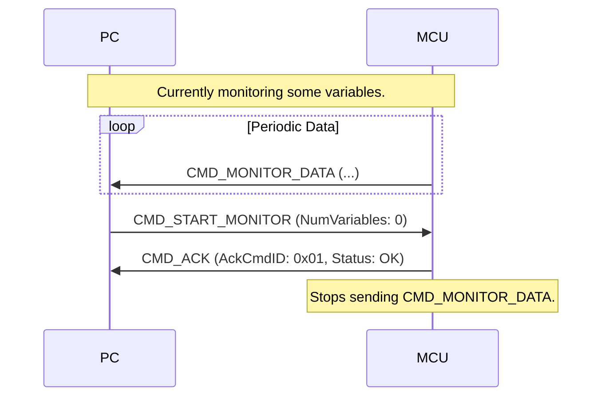
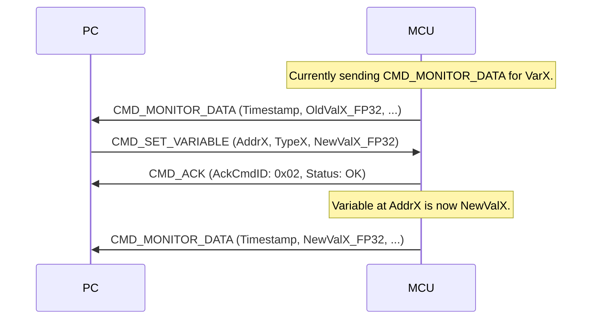

# AresPlot Protocol Specification v1.0

## 1. 概述 (Overview)

AresPlot 是一种基于串行或类似数据流的通信协议，主要用于嵌入式微控制器 (MCU) 系统内部变量的高频监控（类似示波器）和实时参数调整。上位机 (PC) 通过解析 MCU 的 ELF 文件获取全局或静态变量的地址和类型信息，用户选择需监控的变量后，通过本协议与下位机 (MCU) 通信，实现数据的高速传输和参数的动态修改。

**主要特性：**

* **高频数据流：** 支持以较高频率从 MCU 发送变量数据。
* **动态变量选择与控制：** 上位机可指定监控任意数量和组合的变量。`CMD_START_MONITOR` 指令可在监控过程中反复发送以更改监控变量集。通过发送 `NumVariables` 为 0 的 `CMD_START_MONITOR` 指令来停止监控数据流。
* **统一数据类型：** MCU 将所有监控的变量值转换为 FP32 (单精度浮点数) 发送，简化上位机处理。
* **实时调参：** 上位机可向 MCU 发送指令，修改指定内存地址的变量值。
* **采样率可配置（可选）：** 上位机可以请求 MCU 调整数据发送的频率。MCU 在上电后会使用一个默认的采样率。
* **ELF 辅助：** 上位机通过 ELF 文件自动发现变量，协议本身专注于通信。

## 2. 定义 (Definitions)

* **字节序 (Endianness):** 本协议所有多字节字段均采用 **小端序 (Little Endian)**。
* **浮点数 (Floating Point):** 本协议中所有浮点数值均采用 **FP32 (IEEE 754 单精度浮点数)** 格式，并按小端序传输。
* **PC:** 上位机，通常是个人计算机。
* **MCU:** 下位机，嵌入式微控制器。

## 3. 连接拓扑 (Connection Topology)

MCU 与 PC 通过串行接口（如 UART, USB CDC）或任何支持可靠有序字节流的通道连接。


## 4. 通用帧结构 (General Frame Structure)

所有 AresPlot 通信都遵循一个固定的序列：帧起始符 (SOP)，命令ID (CMD)，负载长度 (LEN)，实际的有效负载 (PAYLOAD)，校验和 (CHECKSUM)，以及帧结束符 (EOP)。

**帧序列:**
`SOP` (1 Byte) -> `CMD` (1 Byte) -> `LEN` (2 Bytes) -> `PAYLOAD` (LEN Bytes) -> `CHECKSUM` (1 Byte) -> `EOP` (1 Byte)

**通用帧图示 (概念性):**


**通用帧字段说明:**

| 字段名         | 偏移 (字节, 从SOP) | 大小 (字节) | 数据类型 | 描述                                                                 |
|----------------|--------------------|-------------|----------|----------------------------------------------------------------------|
| SOP            | 0                  | 1           | uint8_t  | 帧起始符 (`0xA5`)                                                      |
| CMD            | 1                  | 1           | uint8_t  | 命令标识符                                                               |
| LEN            | 2                  | 2           | uint16_t | `PAYLOAD` 字段的字节长度 (小端序)                                         |
| PAYLOAD        | 4                  | `LEN` 值    | uint8_t[]| 实际数据负载，其结构取决于 `CMD`                                           |
| CHECKSUM       | 4 + `LEN` 值       | 1           | uint8_t  | 从 `CMD` 到 `PAYLOAD` (包含这两者) 所有字节的简单异或和 (XOR Sum)            |
| EOP            | 5 + `LEN` 值       | 1           | uint8_t  | 帧结束符 (`0x5A`)                                                      |

## 5. 命令定义 (Command Definitions)

### 5.1. `AresOriginalType_t` 枚举 (Original Data Type Enumeration)

此枚举用于在 `CMD_START_MONITOR` 和 `CMD_SET_VARIABLE` 命令中指定变量的原始数据类型。MCU 根据此类型从内存读取数据或向内存写入数据。

| 值   | 名称                 | 描述                                   |
| :--- | :------------------- | :------------------------------------- |
| 0x00 | `ARES_TYPE_INT8`     | 有符号 8 位整数                         |
| 0x01 | `ARES_TYPE_UINT8`    | 无符号 8 位整数                         |
| 0x02 | `ARES_TYPE_INT16`    | 有符号 16 位整数 (小端序)               |
| 0x03 | `ARES_TYPE_UINT16`   | 无符号 16 位整数 (小端序)               |
| 0x04 | `ARES_TYPE_INT32`    | 有符号 32 位整数 (小端序)               |
| 0x05 | `ARES_TYPE_UINT32`   | 无符号 32 位整数 (小端序)               |
| 0x06 | `ARES_TYPE_FLOAT32`  | 32 位单精度浮点数 (IEEE 754, 小端序)    |
| 0x07 | `ARES_TYPE_FLOAT64`  | 64 位双精度浮点数 (IEEE 754, 小端序) * |
| 0x08 | `ARES_TYPE_BOOL`     | 布尔型 (通常 1 字节)                   |

*注意: `ARES_TYPE_FLOAT64` 仅在 MCU 支持且带宽允许时使用。所有类型在传输时都会被转换为 FP32 (用于 `CMD_MONITOR_DATA`) 或从 FP32 转换而来 (用于 `CMD_SET_VARIABLE`)。*

### 5.2. PC -> MCU 命令

#### 5.2.1. `CMD_START_MONITOR (0x01)`: 请求开始/更新/停止监控变量

* **用途:** 上位机指定要监控的变量列表（0 到 255 个，实际数量受带宽限制）。此命令可在监控过程中反复发送以更改监控变量集。若 `NumVariables` 为 0，则 MCU 停止发送 `CMD_MONITOR_DATA`。
* **帧结构 (示例 N=1 变量, 总计 12 字节 / 96 比特):**
    ```mermaid
    ---
    title: CMD_START_MONITOR (0x01) Frame (Example for N=1 variable)
    ---
    packet-beta
        0-7: "SOP (0xA5)"
        8-15: "CMD (0x01)"
        16-31: "LEN (N=1: 0x0006)"
        32-39: "NumVariables (N)"
        40-71: "Var1_Address"
        72-79: "Var1_OriginalType"
        80-87: "CHECKSUM"
        88-95: "EOP (0x5A)"
    ```
* **帧结构 (示例 N=0, 停止监控, 总计 7 字节 / 56 比特):**
    ```mermaid
    ---
    title: CMD_START_MONITOR (0x01) Frame (Example for N=0, Stop Monitoring)
    ---
    packet-beta
        0-7: "SOP (0xA5)"
        8-15: "CMD (0x01)"
        16-31: "LEN (N=0: 0x0001)"
        32-39: "NumVariables (0x00)"
        40-47: "CHECKSUM"
        48-55: "EOP (0x5A)"
    ```
* **字段说明:**
    | 字段名             | 偏移 (字节)             | 大小 (字节) | 数据类型           | 描述                                                                 |
    |--------------------|-------------------------|-------------|--------------------|----------------------------------------------------------------------|
    | SOP                | 0                       | 1           | uint8_t            | 帧起始符 (`0xA5`)                                                      |
    | CMD                | 1                       | 1           | uint8_t            | 命令 ID (`0x01`)                                                       |
    | LEN                | 2                       | 2           | uint16_t           | Payload 长度 (`1 + N*5`字节, N 为变量数 0-255, 小端序)                 |
    | **Payload:** |                         |             |                    | (开始于字节偏移 4)                                                        |
    | NumVariables       | 4                       | 1           | uint8_t            | 要监控的变量数量 (N), 范围 0-255。若为 0，则停止数据流。                   |
    | Var1_Address       | 5 (若 N>0)              | 4           | uint32_t           | (若N>0) 第1个变量的内存地址 (小端序)                                     |
    | Var1_OriginalType  | 9 (若 N>0)              | 1           | AresOriginalType_t | (若N>0) 第1个变量的原始数据类型                                          |
    | ...                | ...                     | ...         | ...                | 若N>1, 后续变量信息 (Var_i_Address, Var_i_OriginalType) 重复 N-1 次      |
    | CHECKSUM           | 4 + `LEN`               | 1           | uint8_t            | 校验和                                                               |
    | EOP                | 5 + `LEN`               | 1           | uint8_t            | 帧结束符 (`0x5A`)                                                      |
    
    *注: 若 N=0, `LEN` 为 1 (`0x0100` 小端序), Payload 仅含 `NumVariables`。若 N=1, `LEN` 为 6 (`0x0600`)。*

#### 5.2.2. `CMD_SET_VARIABLE (0x02)`: 请求设置变量值

* **用途:** 上位机请求 MCU 修改指定内存地址的变量值。
* **帧结构 (总计 14 字节 / 112 比特):**
    ```mermaid
    ---
    title: CMD_SET_VARIABLE (0x02) Frame
    ---
    packet-beta
        0-7: "SOP (0xA5)"
        8-15: "CMD (0x02)"
        16-31: "LEN (0x0009)"
        32-63: "Address"
        64-71: "OriginalType"
        72-103: "Value (FP32)"
        104-111: "CHECKSUM"
        112-119: "EOP (0x5A)"
    ```
* **字段说明:**
    | 字段名         | 偏移 (字节) | 大小 (字节) | 数据类型           | 描述                                                                 |
    |----------------|-------------|-------------|--------------------|----------------------------------------------------------------------|
    | SOP            | 0           | 1           | uint8_t            | 帧起始符 (`0xA5`)                                                      |
    | CMD            | 1           | 1           | uint8_t            | 命令 ID (`0x02`)                                                       |
    | LEN            | 2           | 2           | uint16_t           | Payload 长度 (固定为 9, 小端序: `0x0900`)                               |
    | **Payload:** |             |             |                    | (开始于字节偏移 4)                                                        |
    | Address        | 4           | 4           | uint32_t           | 要设置的变量的内存地址 (小端序)                                           |
    | OriginalType   | 8           | 1           | AresOriginalType_t | 变量的原始数据类型                                                      |
    | Value          | 9           | 4           | FP32               | 要设置的新值 (单精度浮点数, 小端序)                                       |
    | CHECKSUM       | 13          | 1           | uint8_t            | 校验和                                                               |
    | EOP            | 14          | 1           | uint8_t            | 帧结束符 (`0x5A`)                                                      |

#### 5.2.3. `CMD_SET_SAMPLE_RATE (0x03)`: 设置采样率 (可选)

* **用途:** (可选) 上位机请求 MCU 设置数据监控的采样频率。MCU 会有一个默认采样率。
* **帧结构 (总计 10 字节 / 80 比特):**
    ```mermaid
    ---
    title: CMD_SET_SAMPLE_RATE (0x03) Frame
    ---
    packet-beta
        0-7: "SOP (0xA5)"
        8-15: "CMD (0x03)"
        16-31: "LEN (0x0004)"
        32-63: "SampleRateHz"
        64-71: "CHECKSUM"
        72-79: "EOP (0x5A)"
    ```
* **字段说明:**
    | 字段名         | 偏移 (字节) | 大小 (字节) | 数据类型 | 描述                                                                 |
    |----------------|-------------|-------------|----------|----------------------------------------------------------------------|
    | SOP            | 0           | 1           | uint8_t  | 帧起始符 (`0xA5`)                                                      |
    | CMD            | 1           | 1           | uint8_t  | 命令 ID (`0x03`)                                                       |
    | LEN            | 2           | 2           | uint16_t | Payload 长度 (固定为 4, 小端序: `0x0400`)                               |
    | SampleRateHz   | 4           | 4           | uint32_t | (Payload) 期望的采样频率，单位 Hz (小端序)。值为 0 可能表示“尽可能快”。 |
    | CHECKSUM       | 8           | 1           | uint8_t  | 校验和                                                               |
    | EOP            | 9           | 1           | uint8_t  | 帧结束符 (`0x5A`)                                                      |

### 5.3. MCU -> PC 命令

#### 5.3.1. `CMD_MONITOR_DATA (0x81)`: 发送监控数据

* **用途:** MCU 定期向上位机发送当前监控变量的值。仅当 `CMD_START_MONITOR` 请求的 `NumVariables` > 0 时发送。
* **帧结构 (示例 N=1 变量, 总计 13 字节 / 104 比特):**
    ```mermaid
    ---
    title: CMD_MONITOR_DATA (0x81) Frame (Example for N=1 variable)
    ---
    packet-beta
        0-7: "SOP (0xA5)"
        8-15: "CMD (0x81)"
        16-31: "LEN (N=1: 0x0008)"
        32-63: "Timestamp"
        64-95: "Value_1 (FP32)"
        96-103: "CHECKSUM"
        104-111: "EOP (0x5A)"
    ```
* **字段说明:**
    | 字段名         | 偏移 (字节)             | 大小 (字节) | 数据类型 | 描述                                                                 |
    |----------------|-------------------------|-------------|----------|----------------------------------------------------------------------|
    | SOP            | 0                       | 1           | uint8_t  | 帧起始符 (`0xA5`)                                                      |
    | CMD            | 1                       | 1           | uint8_t  | 命令 ID (`0x81`)                                                       |
    | LEN            | 2                       | 2           | uint16_t | Payload 长度 (`4 + N*4`字节, N 为变量数, 小端序)                     |
    | **Payload:** |                         |             |          | (开始于字节偏移 4)                                                        |
    | Timestamp      | 4                       | 4           | uint32_t | MCU 侧的时间戳 (例如毫秒, 小端序)                                       |
    | Value_1        | 8                       | 4           | FP32     | 第1个变量的值 (单精度浮点数, 小端序)                                     |
    | ...            | ...                     | ...         | ...      | 若N>1, 后续变量值 (Value_i) 重复 N-1 次                                |
    | CHECKSUM       | 4 + `LEN`               | 1           | uint8_t  | 校验和                                                               |
    | EOP            | 5 + `LEN`               | 1           | uint8_t  | 帧结束符 (`0x5A`)                                                      |
    
    *注: 数据值的顺序必须与 `CMD_START_MONITOR` 请求中的变量顺序严格一致。若 N=1, `LEN` 为 8 (`0x0800`)。*

#### 5.3.2. `CMD_ACK (0x82)`: 命令确认/应答

* **用途:** MCU 回复上位机发来的命令，告知执行状态。
* **帧结构 (总计 7 字节 / 56 比特):**
    ```mermaid
    ---
    title: CMD_ACK (0x82) Frame
    ---
    packet-beta
        0-7: "SOP (0xA5)"
        8-15: "CMD (0x82)"
        16-31: "LEN (0x0002)"
        32-39: "AckCmdID"
        40-47: "Status"
        48-55: "CHECKSUM"
        56-63: "EOP (0x5A)"
    ```
* **字段说明:**
    | 字段名         | 偏移 (字节) | 大小 (字节) | 数据类型 | 描述                                                                 |
    |----------------|-------------|-------------|----------|----------------------------------------------------------------------|
    | SOP            | 0           | 1           | uint8_t  | 帧起始符 (`0xA5`)                                                      |
    | CMD            | 1           | 1           | uint8_t  | 命令 ID (`0x82`)                                                       |
    | LEN            | 2           | 2           | uint16_t | Payload 长度 (固定为 2, 小端序: `0x0200`)                               |
    | **Payload:** |             |             |          | (开始于字节偏移 4)                                                        |
    | AckCmdID       | 4           | 1           | uint8_t  | 被确认的来自 PC 的命令 ID (`0x01`, `0x02`, `0x03`)                      |
    | Status         | 5           | 1           | uint8_t  | 执行状态 (见下表)                                                       |
    | CHECKSUM       | 6           | 1           | uint8_t  | 校验和                                                               |
    | EOP            | 7           | 1           | uint8_t  | 帧结束符 (`0x5A`)                                                      |

* **Status 字段值:**
    | 值   | 名称                             | 描述                                                     |
    | :--- | :------------------------------- | :------------------------------------------------------- |
    | 0x00 | `STATUS_OK`                      | 成功                                                     |
    | 0x01 | `STATUS_ERROR_CHECKSUM`          | 接收到的帧校验和错误                                     |
    | 0x02 | `STATUS_ERROR_UNKNOWN_CMD`       | 未知命令                                                 |
    | 0x03 | `STATUS_ERROR_INVALID_PAYLOAD`   | Payload 格式或长度错误                                   |
    | 0x04 | `STATUS_ERROR_ADDR_INVALID`      | 无效地址 (如对齐、范围)                                  |
    | 0x05 | `STATUS_ERROR_TYPE_UNSUPPORTED`  | 不支持的数据类型                                         |
    | 0x06 | `STATUS_ERROR_RATE_UNACHIEVABLE` | (若`CMD_SET_SAMPLE_RATE`被调用) 无法达到请求的采样率     |
    | 0x07 | `STATUS_ERROR_MCU_BUSY_OR_LIMIT` | MCU 繁忙或内部资源限制 (如变量数量超出MCU处理能力)           |
    | 0xFF | `STATUS_ERROR_GENERAL_FAIL`      | 通用失败                                                 |

#### 5.3.3. `CMD_ERROR_REPORT (0x8F)`: MCU 主动错误报告 (可选)

* **用途:** MCU 主动向上位机报告一些异步发生的错误或严重问题。
* **帧结构 (示例 M=3 字节消息, 总计 10 字节 / 80 比特):**
    ```mermaid
    ---
    title: CMD_ERROR_REPORT (0x8F) Frame (Example for M=3 byte message)
    ---
    packet-beta
        0-7: "SOP (0xA5)"
        8-15: "CMD (0x8F)"
        16-31: "LEN (M=3: 0x0004)"
        32-39: "ErrorCode"
        40-63: "Optional_Message (M=3 bytes)"
        64-71: "CHECKSUM"
        72-79: "EOP (0x5A)"
    ```
* **字段说明:**
    | 字段名             | 偏移 (字节)             | 大小 (字节) | 数据类型 | 描述                                                                 |
    |--------------------|-------------------------|-------------|----------|----------------------------------------------------------------------|
    | SOP                | 0                       | 1           | uint8_t  | 帧起始符 (`0xA5`)                                                      |
    | CMD                | 1                       | 1           | uint8_t  | 命令 ID (`0x8F`)                                                       |
    | LEN                | 2                       | 2           | uint16_t | Payload 长度 (`1 + M`字节, M为消息长度, 小端序)                       |
    | **Payload:** |                         |             |          | (开始于字节偏移 4)                                                        |
    | ErrorCode          | 4                       | 1           | uint8_t  | 错误代码 (可自定义一套 MCU 内部错误码)                                  |
    | Optional_Message   | 5                       | M           | uint8_t[]| 可选的错误描述信息 (ASCII/UTF-8 字符串或自定义数据)                     |
    | CHECKSUM           | 4 + `LEN`               | 1           | uint8_t  | 校验和                                                               |
    | EOP                | 5 + `LEN`               | 1           | uint8_t  | 帧结束符 (`0x5A`)                                                      |
    *注: `LEN` 示例值为 `0x0400` (小端序) 当 M=3。图示仅为M=3的情况。*

## 6. 带宽与变量监控数量建议

下表提供了在不同 UART 波特率和期望采样频率下，理论上可以同时监控的最大 FP32 变量数量 (N) 的建议。这些计算基于 `CMD_MONITOR_DATA` 帧的结构 (`11 + N*4` 字节) 和标准 (1位起始位、8位数据位、1位校验位、1位停止位) 的 UART 传输（11位/字节）。

**计算公式:** `N <= ((波特率 / 采样频率) - 110) / 44`

| 波特率 (bps) | 期望采样频率 (Hz) | 理论最大变量数 (N) | CMD_MONITOR_DATA 帧大小 (字节, N个变量) | 带宽利用率 (大致) |
| --- | --- | --- | --- | --- |
| 9600 | 10 | 19 | 86 | 0.98 |
| 19200 | 10 | 41 | 174 | 0.99 |
|  | 100 | 1 | 14 | 0.8 |
| 38400 | 10 | 84 | 346 | 0.99 |
|  | 100 | 6 | 34 | 0.97 |
| 57600 | 10 | 128 | 522 | 0.99 |
|  | 100 | 10 | 50 | 0.95 |
| 115200 | 10 | 255 | 1030 | 0.98 |
|  | 100 | 23 | 102 | 0.97 |
| 230400 | 100 | 49 | 206 | 0.98 |
|  | 1000 | 2 | 18 | 0.85 |
| 460800 | 100 | 102 | 418 | 0.99 |
|  | 1000 | 7 | 38 | 0.9 |
| 921600 | 100 | 206 | 834 | 0.99 |
|  | 1000 | 18 | 82 | 0.97 |
| 1000000 | 100 | 224 | 906 | 0.99 |
|  | 1000 | 20 | 90 | 0.99 |
| 2000000 | 100 | 255 | 1030 | 0.56 |
|  | 1000 | 42 | 178 | 0.97 |

**说明:**
* "理论最大变量数" 是向下取整的结果。
* "带宽利用率" 是指在监控最大数量变量时，数据传输占用的带宽百分比。接近100%意味着链路饱和。
* 实际可监控的变量数量还可能受到 MCU 处理能力、内存、以及串口驱动效率等因素的影响。建议在接近理论上限时进行测试。
* 对于高采样频率 (如 1kHz)，低波特率下可能无法监控任何变量。
* `NumVariables` 字段本身支持最多 255 个变量，但实际受限于上述带宽和 MCU 能力。

## 7. 交互时序 (Interaction Sequences)

### 7.1. 成功启动监控与数据流


### 7.2. 更改监控变量


### 7.3. 停止监控


### 7.4. 设置变量值


## 8. 校验和计算 (Checksum Calculation)

如通用帧结构中所述，校验和是 `CMD` 字段开始到 `PAYLOAD` 字段结束的所有字节的简单异或和。

**示例 (伪代码):**

```c
uint8_t calculate_checksum(uint8_t cmd, uint16_t len_val, uint8_t* payload_ptr) {
    uint8_t checksum = 0;
    checksum ^= cmd;
    checksum ^= (uint8_t)(len_val & 0xFF);       // Low byte of len_val
    checksum ^= (uint8_t)((len_val >> 8) & 0xFF); // High byte of len_val

    for (uint16_t i = 0; i < len_val; i++) {
        checksum ^= payload_ptr[i];
    }
    return checksum;
}
```
发送方计算并附加校验和。接收方对接收到的 `CMD`, `LEN` (两字节), `PAYLOAD` 计算校验和，并与接收到的 `CHECKSUM` 字段比较。

## 9. 注意事项 (Considerations)

* **MCU 性能:** MCU 需要有足够的处理能力来以请求的频率读取内存、执行类型转换 (尤其是整型到浮点型)、组包并通过串行接口发送数据。ISR (中断服务程序) 中的处理应尽可能高效。
* **带宽：** 监控的变量数量和采样频率直接影响带宽需求。上位机应根据选定的波特率和期望的采样频率，合理选择监控的变量数量，参考第6节的建议。
* **错误处理:** 除了校验和，还应考虑超时机制。对于高频数据流，有时丢失少量数据包是可以接受的，重传机制可能会增加复杂性。
* **原子性:** 在读取或写入 MCU 变量时，如果这些变量可能被中断或其他并发任务修改，需要确保操作的原子性（例如，通过关中断或使用互斥量）。
* **可扩展性:** 未来可考虑加入更多命令，如查询 MCU 能力等。